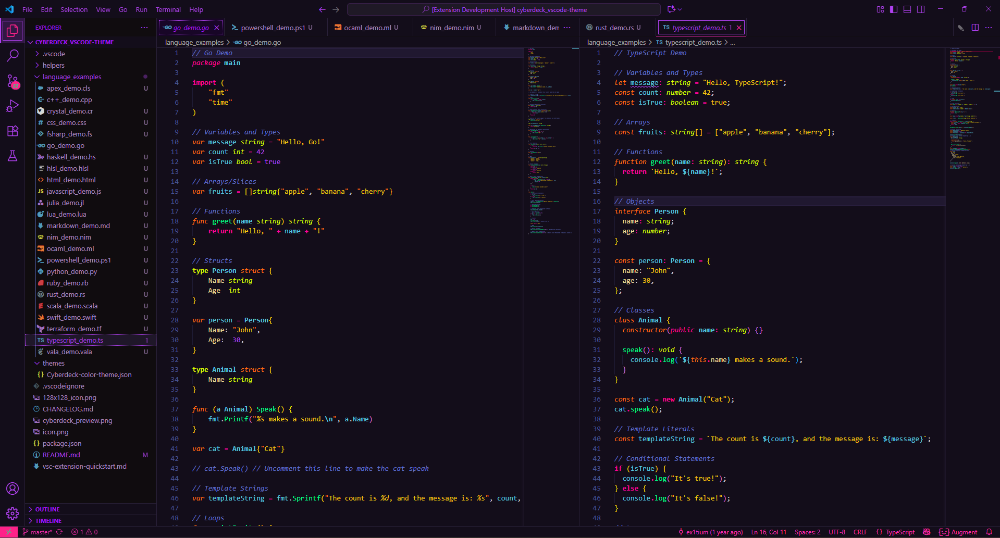
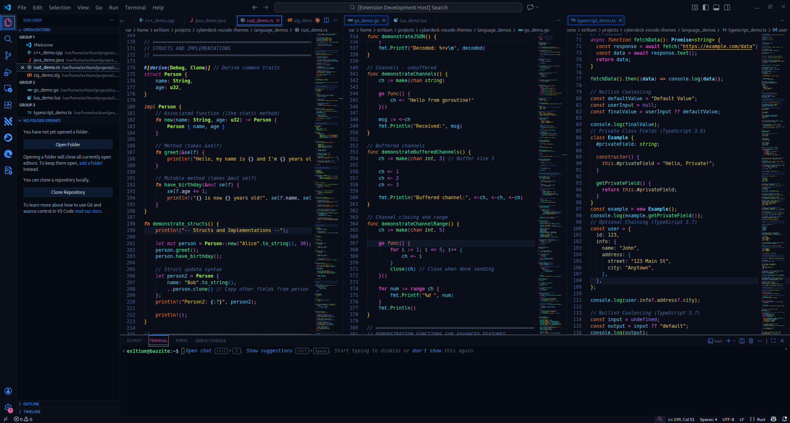
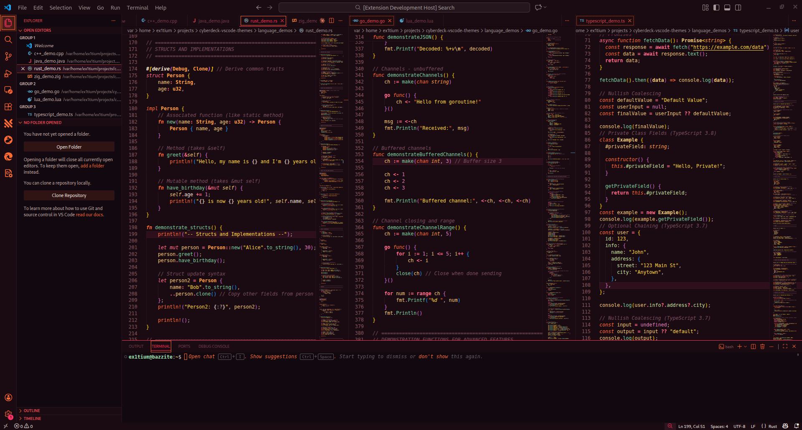
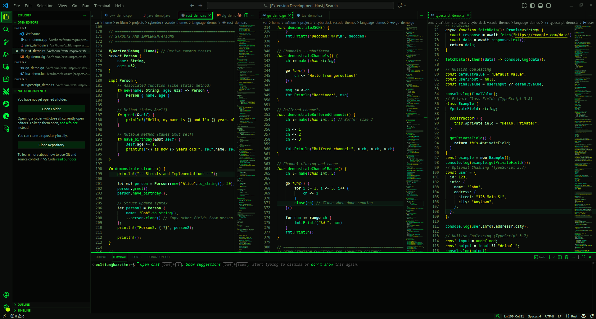
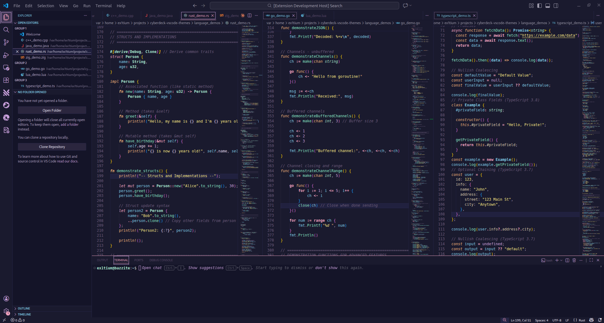
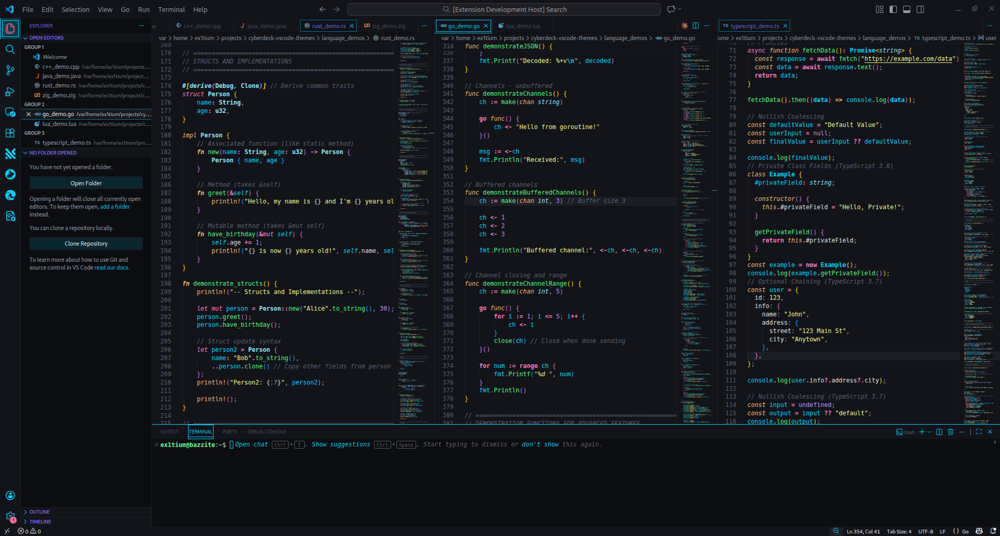
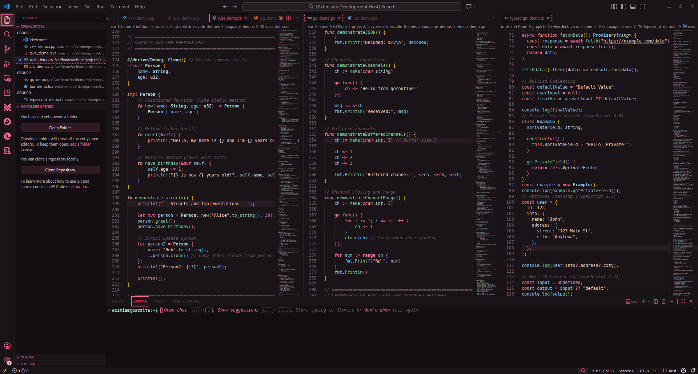
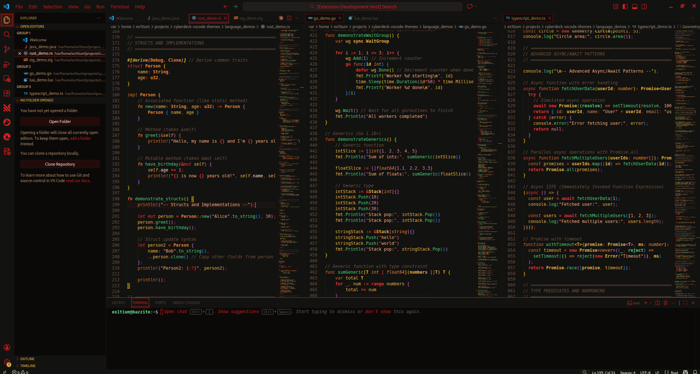
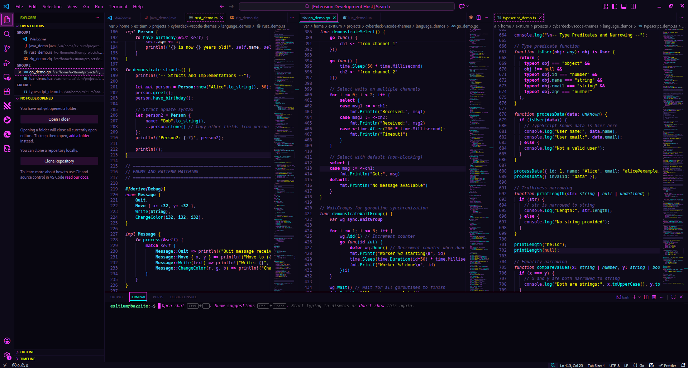
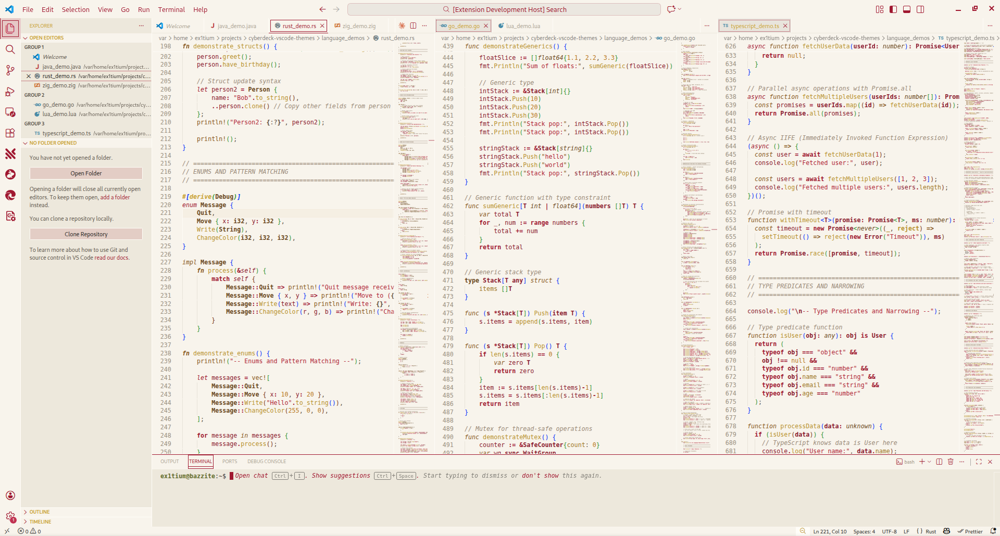

# Cyberdeck 🌃

> *A neo-retro-futuristic neural interface for the modern code cowboy.*

[](https://marketplace.visualstudio.com/items?itemName=ex1tium.cyberdeck)
[](https://marketplace.visualstudio.com/items?itemName=ex1tium.cyberdeck)
[](https://marketplace.visualstudio.com/items?itemName=ex1tium.cyberdeck)
[](LICENSE)

**Cyberdeck** is a cyberpunk-inspired dark theme collection for Visual Studio Code featuring deep backgrounds, vibrant neon accents, and comprehensive syntax highlighting. Designed for developers who want an immersive, high-contrast coding experience with modern semantic highlighting support.

---

## 🎨 Theme Variants

### Cyberdeck (Original)
Deep purple-black backgrounds with vibrant neon pink, cyan, and green accents.



### Cyberdeck Midnight
Cool blue-shifted variant with electric blue tones and cyan accents.



### Cyberdeck Sunset
Blade Runner 2049 inspired warm palette with deep burgundy backgrounds and vibrant orange, coral, and gold accents.



### Cyberdeck Trix
Classic hacker aesthetic with green-tinted backgrounds and Matrix green accents.



### Cyberdeck Vapor
Vaporwave lo-fi aesthetic with dark blue-purple backgrounds and soft pastel accents.



### Cyberdeck Chrome
Corporate sterilized theme with cold blue-gray backgrounds and neon accent pops.



### Cyberdeck Sakura
Japanese cyberpunk aesthetic with cherry blossom pink and jade green accents.



### Cyberdeck Dynasty
Neo-Feudalistic warm lacquer black backgrounds with imperial crimson, jade green, and gold accents inspired by traditional Chinese color palettes.



### Cyberdeck Arcade
80s arcade cabinet aesthetic with bold neon on deep purple-black. Electric cyan, hot magenta, and bright yellow evoke CRT glow and coin-op nostalgia.



### Cyberdeck Fami (Light)
Warm cream backgrounds with wine red and controller gold accents inspired by the Famicom. A retro 80s console aesthetic for those who prefer light themes.



---

## ✨ Features

### Cyberpunk Aesthetic
- **Deep immersive backgrounds** for reduced eye strain
- **Vibrant neon accents** that pop without overwhelming
- **High contrast** color schemes optimized for readability
- **Consistent visual language** across editor, UI, and terminal

### Modern Highlighting System
- **Semantic Highlighting**: Context-aware intelligent coloring using language servers
- **TextMate Grammar**: Comprehensive fallback for non LSP environments

### 💎 First-Class Language Support

| Language | Features |
|----------|----------|
| **TypeScript/JavaScript** | Types, interfaces, enums, decorators, JSX/TSX |
| **Rust** | Lifetimes, macros, traits, ownership keywords |
| **Go** | Goroutines, channels, interfaces, structs |
| **Python** | Decorators, magic methods, type hints |
| **Java** | Annotations, generics, lambdas |
| **Zig** | Comptime, error handling, builtins |
| **Lua** | Complete language feature coverage |

### Additional Features
- **30+ Languages**: C/C++, C#, PHP, Ruby, HTML/CSS, JSON, Markdown, and more
- **Git Integration**: Clear visual indicators for changes
- **Terminal Colors**: Custom ANSI palette matching each variant
- **Bracket Pairs**: Styled bracket pair colorization
- **Inline Hints**: Themed parameter hints and type annotations
- **Modern UI**: Support for Command Center, Chat, Sticky Scroll

---

## 🚀 Installation

### From VS Code Marketplace

1. Open **Extensions** sidebar (`Ctrl+Shift+X` / `Cmd+Shift+X`)
2. Search for **"Cyberdeck"**
3. Click **Install**
4. Select your variant:
   - Open Command Palette (`Ctrl+Shift+P` / `Cmd+Shift+P`)
   - Type **"Color Theme"**
   - Choose from: **Cyberdeck**, **Cyberdeck Midnight**, **Cyberdeck Sunset**, **Cyberdeck Trix**, **Cyberdeck Vapor**, **Cyberdeck Chrome**, **Cyberdeck Sakura**, **Cyberdeck Dynasty**, **Cyberdeck Arcade**, or **Cyberdeck Fami** (light)

### From VSIX File

```bash
code --install-extension cyberdeck-1.0.0.vsix
```

### Manual Installation

1. Download the latest release from [GitHub Releases](https://github.com/ex1tium/cyberdeck-vscode-themes/releases)
2. Extract to your VS Code extensions folder:
   - **Windows**: `%USERPROFILE%\.vscode\extensions`
   - **macOS/Linux**: `~/.vscode/extensions`
3. Reload VS Code

---

## 🎨 Color Palettes

### Cyberdeck (Original)

| Color | Hex | Usage |
|-------|-----|-------|
| Deep Purple Black | `#130d1a` | Editor background |
| Warm Off-White | `#ded2cd` | Primary text |
| Vibrant Purple | `#b141f1` | Accents, numbers |
| Hot Pink | `#ff2289` | Keywords, constants |
| Cyan | `#58c7e0` | Variables, types |
| Neon Green | `#00ff88` | Functions, methods |
| Golden Yellow | `#f9c80e` | Strings |

### Cyberdeck Midnight

| Color | Hex | Usage |
|-------|-----|-------|
| Deep Blue Black | `#0a0e18` | Editor background |
| Cool Blue White | `#c8d4e8` | Primary text |
| Electric Blue | `#4090ff` | Accents, info |
| Magenta | `#c048b0` | Keywords |
| Ice Cyan | `#60c8e8` | Variables, types |
| Mint Green | `#50e8a0` | Functions, methods |
| Warm Yellow | `#e8c050` | Strings |

---

## ⚙️ Recommended Settings

```json
{
  // Enable semantic highlighting
  "editor.semanticHighlighting.enabled": true,

  // Enable bracket pair colorization
  "editor.bracketPairColorization.enabled": true,
  "editor.guides.bracketPairs": "active",

  // Font recommendations
  "editor.fontFamily": "'Fira Code', 'JetBrains Mono', 'Cascadia Code', monospace",
  "editor.fontLigatures": true,
  "editor.fontSize": 14,
  "editor.lineHeight": 1.6
}
```

### Recommended Fonts
- [Fira Code](https://github.com/tonsky/FiraCode)
- [JetBrains Mono](https://www.jetbrains.com/lp/mono/)
- [Cascadia Code](https://github.com/microsoft/cascadia-code)

---

## 🔧 Customization

Override colors for any variant in your VS Code settings:

```json
{
  "workbench.colorCustomizations": {
    "[Cyberdeck]": {
      "editor.background": "#0f0a15"
    },
    "[Cyberdeck Sunset]": {
      "editor.background": "#150810"
    },
    "[Cyberdeck Trix]": {
      "editor.background": "#080a08"
    }
  }
}
```

For syntax highlighting overrides:

```json
{
  "editor.tokenColorCustomizations": {
    "[Cyberdeck]": {
      "comments": "#8a9ba8",
      "keywords": "#ff6b9d"
    }
  }
}
```

Use **"Developer: Inspect Editor Tokens and Scopes"** from the Command Palette to find token scopes.

---

## 🛠️ Contributing

### Building from Source

```bash
# Install dependencies
npm install

# Build theme files
npm run build

# Watch for changes during development
npm run watch
```

### Creating New Variants

1. Create a new palette in `src/palettes/` (copy an existing one as template)
2. Add the palette to `src/build.js`
3. Register the theme in `package.json` under `contributes.themes`
4. Run `npm run build`

---

## 📝 License

[MIT License](LICENSE)

---

## 🔗 Links

- [GitHub Repository](https://github.com/ex1tium/cyberdeck-vscode-themes)
- [VS Code Marketplace](https://marketplace.visualstudio.com/items?itemName=ex1tium.cyberdeck)
- [Issue Tracker](https://github.com/ex1tium/cyberdeck-vscode-themes/issues)
- [Changelog](CHANGELOG.md)

---

<div align="center">

**[Install Now](https://marketplace.visualstudio.com/items?itemName=ex1tium.cyberdeck)** | **[View Source](https://github.com/ex1tium/cyberdeck-vscode-themes)** | **[Report Issue](https://github.com/ex1tium/cyberdeck-vscode-themes/issues)**

*Made with 💜 for code cowboys everywhere.*

</div>
